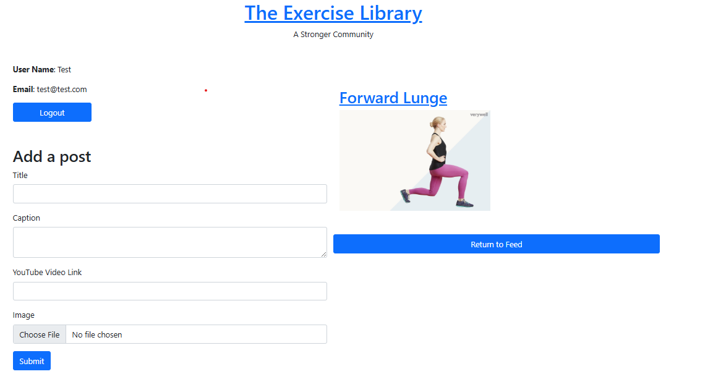

# TheExerciseLibrary
https://theexerciselibrary.onrender.com/

A full-stack Social Networking site that allows users to share exercises with each other.
(Still in development, although core functionality is present)

Features user login, content uploads, and interactive elements such as likes and comments. I built RESTful APIs with Express, followed an MVC architecture, and used EJS for server-side rendering. Authentication was handled via Passport, and I implemented full CRUD functionality — all while applying key HTTP concepts like routing, status codes, and middleware.

